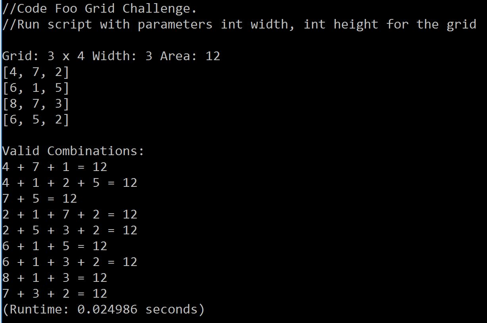
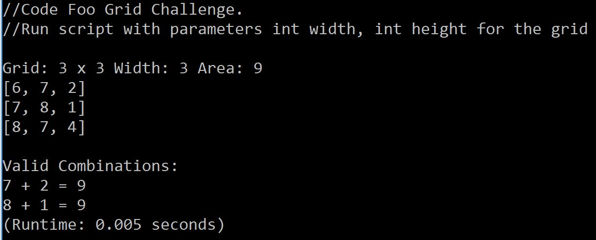
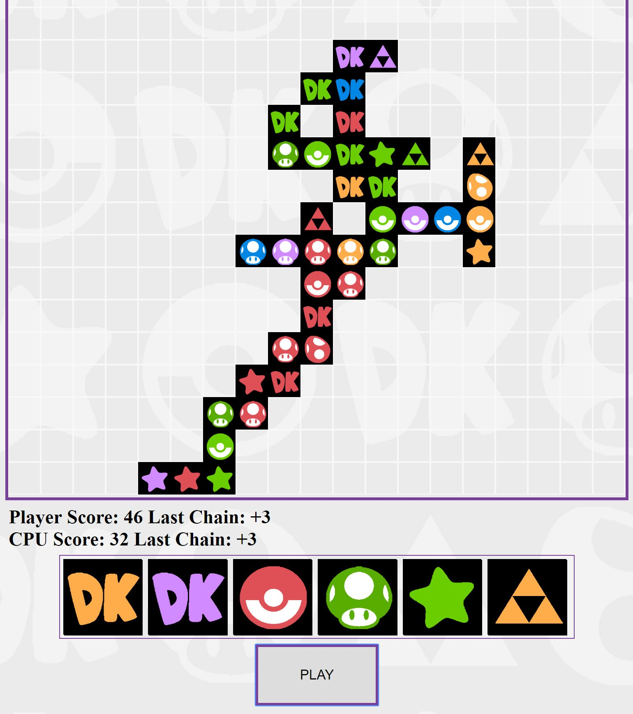

# CodeFoo7
CodeFoo2017

<b>1) My CodeFoo Video Link:</b>
 
<a href="http://google.com">htttp://youtube/shanevideo</a> //Coming Soon!

-

<b> 2) King Kong Questions:</b>

The Empire State building stands at 1,250 ft tall with antena that goes up an adistional 204 ft. The building
is about 187 ft wide and 424 ft long. With a area of about 79,288 square ft 
and volume of 99,110,00 ft^3. If we assume we are using standard lincohn logs of about 10 1/2 inches in length and
3/4 inches in height then stacking the logs as a 10 1/2 by 10 1/2 hollow square would result in a . 
 
-

<b>3) Grid Solution (Ruby):</b>
 
 
This algorithm builds a grid of random single digit numbers and finds all possible combinations that add up to the area of the grid. The program builds the grid then computes the chains starting at every x,y index inside the grid. First, we test that the index exists. The function then recursively calls itself to check the value of every index that surrounds x,y. For each index we check, we add all the indexes that have proven to exist. If the sum of the index values is less than the area of the grid we again recursively call the function to search further chains. When the sum equals the area of the grid we add the chain to a data structure of valid answers. We check that each new chain added to our list of answers is unique by sorting the answers then comparing their contents. The answer must also have a total number of values that is at least the width of the grid minus one. The final list of answers is printed to the screen:
 
 

 
 
I've also implemented this ruby script to take two parameters, width and height. The results take much longer to process as more combinations and answers become possible:
 
 

-

<b>4) Android App (Java):</b>
  
This Android (4.4 KitKat minimum) application gathers and displays data from IGN's webapi. I build a List View which contains list objects that include articles, videos, and video lists. The app dynamically loads data as the user scrolls. The user can navigate to the content of the article in a web view. For additional features I want to make use of the tags that were provided in the api. I first considered a search bar but was reminded of how IGN's page is organized. The tabs that let you navigate to between articles relating to PC, PS4, XBOX etc. are extremely convenient. I designed my Android application with a horizontally scrollable list of tabs to navigate between articles related to the users taste or preference.
 

-

<b>5) Front End (JavaScript):</b>
  
This web application was built to match IGN's design and be assecable for all devices. The application will also dynamically load data and allows to be sorted by catagory. 
 

-

<b>Bonus (HTML5):</b>
- 
Qwirkle! The most challenging assignment of them all! My high score is 131. (instructions included)

